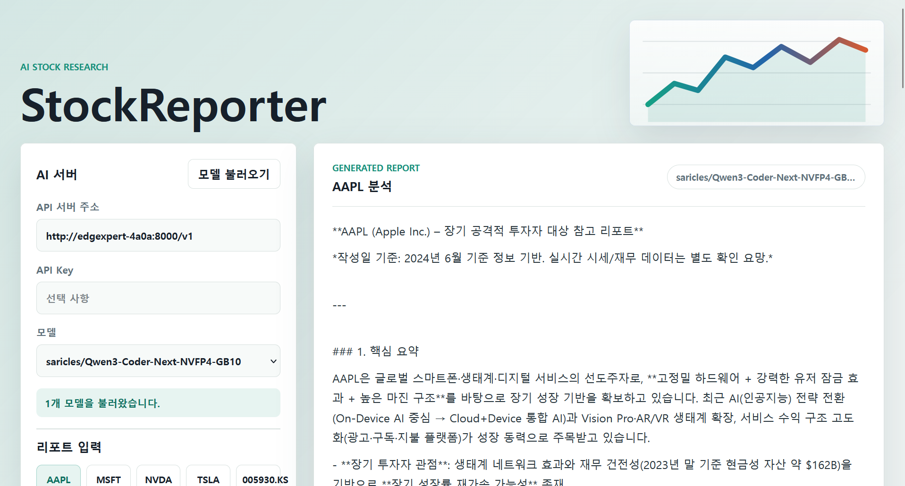

# StockReporter

StockReporter is a Svelte-based web application powered by a user-provided AI API server. Enter an API endpoint, load the available models from that server, choose the model you want, and generate structured stock reports from simple ticker inputs.



## Features

- Connect to a user-provided AI API server.
- Load available model names from the server.
- Select any returned model before generating a report.
- Generate structured stock reports with ticker, market, investment horizon, risk profile, and language options.
- Save API server settings locally in the browser for repeat use.

## AI API compatibility

StockReporter expects an OpenAI-compatible API base URL. The server address is entered in the app, so you can use a local model gateway, private API server, or hosted compatible endpoint.

- Model list: `GET {baseUrl}/models`
- Chat completion: `POST {baseUrl}/chat/completions`
- Optional auth: `Authorization: Bearer {apiKey}`

Example base URL:

```text
http://localhost:8000/v1
```

The API server must allow browser requests from the app origin through CORS.

## Getting started

```bash
npm install
npm run dev
```

Then open the local Vite URL shown in the terminal.

For LAN or tunnel access, the Vite dev server is configured to listen on all hosts.
